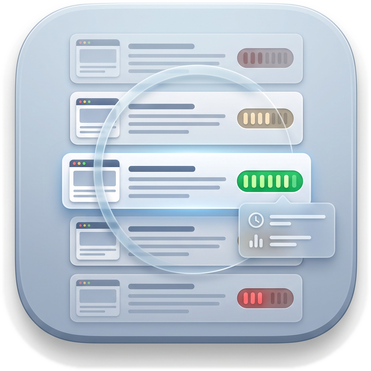

<p align="center">
  
</p>

# Read or Skip

[](LICENSE)
[](https://developer.chrome.com/docs/extensions/develop/concepts/manifest-v3)
[](tests/)

浏览器扩展（Chrome / Edge，Manifest V3）。打开网页后立刻判断这个页面**值得认真读 / 快速扫 / 可以跳过**，并给出相关度、新信息程度、阅读价值、信息可信度。在搜索结果页上直接给每条结果打等级。

判定由 [TypeSafe AI 的 Jev 决策模型](https://typesafe.ai) 完成 —— 它不生成文字，只返回可被代码直接使用的结构化决策（概率、选项、评分），所以足够快、足够便宜。

## 实测数据

在本机（Windows，中国大陆网络直连 `api.typesafe.ai`）实测：

| 环节 | 耗时 |
| --- | --- |
| 本地启发式初判（URL + DOM 结构 + 主题词重合） | < 50 ms |
| Jev 返回完整网页判定（8 个问题并发） | 约 300–400 ms |
| Jev 返回单条搜索结果判定（4 个问题） | 约 270 ms |
| 命中缓存 / 搜索结果预判 | < 20 ms |

单页输入约 1.8k–5.5k tokens，按 $0.042 / 百万输入 token 计（输出免费），折算**每页约 ¥0.0005**。

## 功能

**1. 页面判定浮层**

右下角悬浮卡片。判定词是唯一的第一视觉；综合分以等宽数字挂在标题行右端，顶部的刻度条就是它的图形化表达：

- 相关度 — 相对你在设置里写的「当前关注主题」
- 新信息 — 对已经跟这个方向的人有多新
- 可信度 — 署名、出处、一手来源、内容农场特征
- 时效性 — 多久之后会过时
- 阅读价值 — 高 / 中 / 低
- 综合判定 — 值得认真读 / 快速扫 / 可以跳过

叠加警告：内容与你已掌握的高度重复时显示「⚠️ 可能没有太多新信息」；标题与内容不符或属于商业页 / 登录墙时单独提示；模型置信度偏低时也会明说。

卡片可拖动、可收起成角标、可关闭本次显示。`Alt + Shift + R` 或 `Esc` 控制。

**2. 搜索结果标注**

在 Google / Google 香港 / 必应 / 百度 / 搜狗 / DuckDuckGo / Brave 的结果页上，给每条自然结果标题前插一枚等级徽章（如「值得读 · 87%」），悬停看详情。列表顶部有一行汇总：值得读几条、可扫几条、可跳过几条。

**3. 预判加速**

搜索结果页的评估结果按 URL 写进缓存。点进某条结果时，浮层直接命中缓存，20ms 内出结论，然后后台用正文换成更准的判定。

**4. 其他**

- 视觉系统：15 个设计令牌，明暗双主题（跟随系统），搜索结果徽章按宿主页明暗自动选套
- 可访问性：全局焦点环、`prefers-reduced-motion` 动效降级、44px 命中区、收起不打断键盘焦点
- 站点黑名单（邮箱、网盘、登录页默认排除）
- 隐私模式：可切换为「只发送标题与摘要」
- 本地 LRU 缓存，默认 7 天有效、300 条上限
- 用量统计（页数、调用次数、token、估算花费）
- 404 / 401 / 422 / 429 / 529 分别有明确的错误文案与退避重试

## 安装

1. 打开 `chrome://extensions`（Edge 为 `edge://extensions`）
2. 右上角打开「开发者模式」
3. 点「加载已解压的扩展程序」，选择本仓库根目录
4. 点扩展图标 → 「打开设置」

## 配置 API Key

Jev 目前是早期访问（waitlist）。获取步骤：

1. 在 <https://typesafe.ai> 申请早期访问
2. 拿到权限后登录 <https://console.typesafe.ai>
3. 左侧 **API Keys** → **Create key**
4. 复制形如 `apikey_xxxxxxxx_xxxxxxxx` 的字符串

两种填法，任选其一：

- **设置页填**：扩展图标 → 设置 → 「TypeSafe API Key」→ 点「测试连接」确认 → 保存。Key 存在 `chrome.storage.local`，只在本机。
- **文件填**：`cp src/lib/config.example.js src/lib/config.js`，把 Key 写进 `apiKey` 字段。`config.js` 已被 `.gitignore` 排除，不会进仓库。

设置页的「测试连接」会发一次最小请求，同时把往返延迟打印出来 —— 那就是你机器上浮层判定的典型耗时。

## 工作原理

```
网页加载
  │
  ├─ document_start  注入内容脚本（Shadow DOM，不污染宿主页样式）
  │
  ├─ 命中缓存 / 搜索结果预判 ──────────────► 立即渲染（< 20ms）
  │
  ├─ DOMContentLoaded 抽取正文 + 本地启发式 ► 渲染估算结果（< 50ms，标注「本地估算」）
  │
  └─ 发消息给 service worker
        ├─ 唯一持有 Key、唯一发起跨域请求（绕过页面 CORS 限制）
        ├─ POST api.typesafe.ai/v1/systemone
        │    state    = { url, title, domain, 正文摘录, focusTopics, 结构统计 }
        │    questions = 8 个并发问题（3 个 score / 3 个 choice / 2 个 noul）
        ├─ 解析 answers → 归一化成 verdict + 四个百分比 + 理由
        ├─ 写缓存、记用量、画工具栏徽章
        └─ 返回 ──────────────────────────► 原地升级卡片（约 300–400ms）
```

Jev 的三种问题原语对应三种用途：

| 原语 | 用途 | 本项目的问法 |
| --- | --- | --- |
| `score` | 有序等级打分 | 相关度、新信息程度、可信度、时效性 |
| `choice` | 从选项里挑一个 | 综合判定、阅读价值、内容类型 |
| `noul` | 是 / 否 + 概率 | 「内容与你已掌握的高度重复」 |

模型不产出文字，所以卡片上的「理由」是本地从各分量拼装的，不是生成的，也不会编造。

## 目录结构

```
manifest.json
icons/                     图标（由 tools/make_icons.py 生成）
src/
  lib/
    namespace.js           全局命名空间（最先加载）
    config.example.js      配置模板
    config.js              本地密钥（gitignored）
    constants.js           枚举、默认设置、域名可信度表
    jev.js                 Jev 客户端（重试、退避、答案解析）
    storage.js             设置 / LRU 缓存 / 统计
    questions.js           8 个问题的定义 + 结果归一化
    heuristics.js          本地启发式打分
    extract.js             正文抽取（正文候选打分，非完整 Readability）
  background/
    service-worker.js      消息路由、跨域调用、徽章
  content/
    hud.js                 页面浮层
    serp.js                搜索结果标注
  popup/                   工具栏弹窗
  options/                 设置页
tools/
  make_icons.py            生成 PNG 图标（纯标准库）
  test_jev.mjs             用真实 API 跑三个场景，验证问法与映射
  bench_latency.mjs        输入长度对延迟的影响
tests/
  run.mjs                  零依赖测试运行器
  harness/                 jsdom 环境 + chrome API 模拟 + 断言库
  cases/                   10 个套件 / 218 个用例
```

## 开发与自测

```bash
npm install                  # 只装一个开发依赖 jsdom；扩展本身零依赖、无构建步骤
npm test                     # 全部 218 个用例，约 13 秒
npm test -- heuristics       # 只跑名字里带 heuristics 的套件
npm test -- 并发              # 也可以按中文用例名过滤
```

```bash
# 用真实 API 验证判定质量（会打印 Jev 的原始 answers）
node tools/test_jev.mjs

# 输入长度对延迟的影响
node tools/bench_latency.mjs
```

测试是零运行时依赖的：`tests/harness/` 自己实现了断言库、用例注册表、chrome API 模拟，
用 jsdom 造真实 DOM（含 Shadow DOM、MutationObserver、rAF），
再把 `manifest.json` 里声明的脚本**按原样、按原顺序**注入 ——
测到的就是浏览器真正会加载的那份代码，不是复制品。

| 套件 | 覆盖 |
| --- | --- |
| `01-manifest` | 引用的文件都存在、图标是真 PNG、注入顺序、权限与代码用到的 API 对得上 |
| `02-heuristics` | 域名可信度分层、路径信号、主题重合度、scorePage 的每条判定分支 |
| `03-jev` | 三种原语的解析、请求构造、401/422/429/529/超时/网络错误的分类与重试 |
| `04-questions` | 8 个问题的结构、答案到界面字段的映射、理由文案的每个分支 |
| `05-storage` | URL 归一化去跟踪参数、缓存 TTL、LRU、预判不覆盖完整评估、并发写入 |
| `06-extract` | 正文去噪、主节点选择、链接密度、隐私模式与截断 |
| `07-serp` | 6 个引擎的识别、徽章插入位置、站内链接过滤、汇总统计、失败降级 |
| `08-hud` | 挂载条件与每种「不弹」的原因、两阶段升级、收起/快捷键、错误提示 |
| `09-service-worker` | 消息路由、缓存与 force、并发池上限、徽章、快捷键转发、安装流程 |
| `10-pages` | 弹窗与设置页的表单、主题标签、保存与夹紧、连接自测 |

### 测试抓到的真实缺陷

第一轮 39 个用例挂了 27 个，其中几个会让扩展完全不可用：

1. `heuristics.js` 导出了未定义的 `isSearchResultsPage` —— 加载即抛 `ReferenceError`，
   整条内容脚本链断掉，浮层**静默不出现**（异常被 `init().catch(() => {})` 吞掉）。
   这是最坏的一类：用户只看到「什么都没发生」。
2. service worker 把局部函数当成模块导出调用（`RS.extractStateFallback`、`RS.heuristicsDomain`）——
   搜索结果标注**从未成功过一次**，每一条结果都在后台抛异常。
3. `force: true` 没有被后台采纳 —— 点「重新评估」只是把缓存又原样吐一遍。
4. 搜索结果命中缓存时被当成新调用计入统计 —— 翻回上一页会凭空多出调用次数和 token。
5. 缓存写入没有串行化 —— 并发 5 路评估互相覆盖写，部分结果丢掉，
   导致「点进结果秒出结论」时灵时不灵。
6. `serp.js` 用 `/(baidu)\./` 这种宽松匹配过滤站内链接，把 `baijiahao.baidu.com`
   这类真内容站一起干掉 —— 而它们恰恰是最需要标可信度的结果。

改了 `src/lib/` 或后台代码后，需要在 `chrome://extensions` 里点一次扩展的刷新按钮，再刷新目标网页。

## 隐私

- API Key 只存在本机 `chrome.storage.local`，或本地的 `src/lib/config.js`
- 除 `api.typesafe.ai` 外，扩展不向任何域名发请求，没有统计上报
- 默认发送正文摘录（上限 6000 字符）。可以在设置里切到「仅标题与摘要」
- 邮箱、网盘、登录页、`localhost` 默认不评估
- 所有判定结果只写在本机缓存里；「清空缓存」可一键删除

## 已知限制

- Jev 无自托管选项，必须联网
- 内容脚本读不到跨域 iframe 和需要登录才有正文的页面，这类页面会走「本地估算」
- 搜索结果页的 DOM 结构由各搜索引擎决定，改版后需要更新 `src/content/serp.js` 里的选择器
- 「新信息程度」是模型的估计，不是真的比对你读过的东西 —— 除非你在设置里把关注主题写细
- 首次调用可能有 0.5–1s 冷启动，之后稳定在 300–400ms

## License

[MIT](LICENSE)
